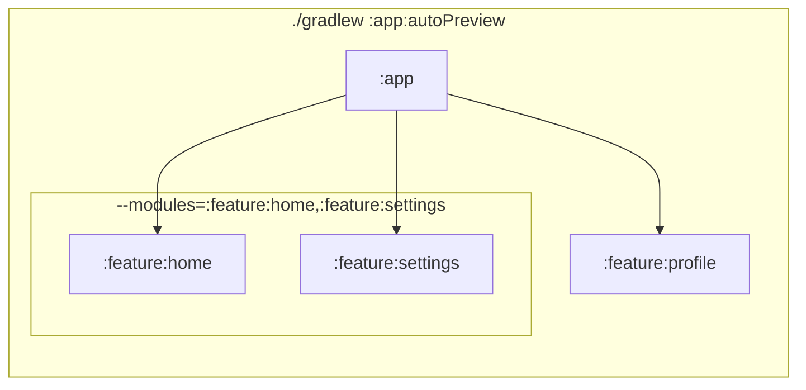
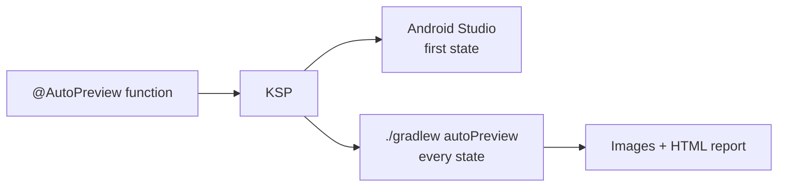

# Compose Auto Preview

[](https://central.sonatype.com/artifact/app.mashlab.autopreview/annotations)
[](https://kotlinlang.org)
[](https://developer.android.com/compose)
[](LICENSE)
[](https://drunkendealer.github.io/compose-auto-preview/)

Stop hand-writing `@Preview` functions. Put one annotation on a screen and get it on every device, in both themes and in every state, in Android Studio and in a browsable map of your whole app.

<table>
  <tr>
    <td width="50%"><a href="https://drunkendealer.github.io/compose-auto-preview/"></a></td>
    <td width="50%"><a href="https://drunkendealer.github.io/compose-auto-preview/#/screen/TodayScreen/Tablet"></a></td>
  </tr>
  <tr>
    <td align="center"><sub>Your app as a graph, starting from the first screen</sub></td>
    <td align="center"><sub>Every state in light and dark, per device</sub></td>
  </tr>
</table>

<p align="center"><a href="https://drunkendealer.github.io/compose-auto-preview/"><b>▶ Open the live demo report</b></a>: the sample app's 10 screens, 169 renders</p>

## Why

To really check a screen you want it on a phone and a tablet, in light and dark, and in every state: empty, loading, error, very long text. Written by hand, that's dozens of `@Preview` functions per screen, and nobody keeps them up to date. Put them all in one file and Android Studio's preview pane slows to a crawl.

Compose Auto Preview splits the work:

| Where | What you see |
|---|---|
| **Android Studio** | Every device and theme, for the first state. Light enough to keep editing. |
| **`./gradlew autoPreview`** | Every device, theme *and* state, rendered to images and opened as a report in your browser. |

## One module

The simplest setup: one module, a few screens, one report.

**1. Apply the plugin** next to KSP. It adds everything else it needs for you.

```kotlin
// app/build.gradle.kts
plugins {
    alias(libs.plugins.ksp)
    id("app.mashlab.autopreview") version "0.2.0"
}
```

**2. List your states.** Any `object` with values of the screen's state type works:

```kotlin
object SettingsSamples {
    val Default          = SettingsState()
    val NotificationsOff = SettingsState(notificationsEnabled = false)
    val Filled           = SettingsState(username = "max")
}
```

**3. Write one preview function** per screen. It must be `internal` or `public`:

```kotlin
@AutoPreview(
    samplesFrom = SettingsSamples::class,
    devices = [Device.Phone, Device.Tablet],
)
@SettingsScreenAutoPreviews
@Composable
internal fun SettingsScreenPreview(
    @PreviewParameter(SettingsScreenPreviewSamplesProvider::class) state: SettingsState,
) = SettingsScreen(state)
```

`@SettingsScreenAutoPreviews` and `SettingsScreenPreviewSamplesProvider` are generated, so they stay red until the first build.

**4. Open the report:**

```
./gradlew :app:autoPreview
```

Studio now shows 4 previews (2 devices × 2 themes). The report has all 12 (× 3 states), and it opens in your browser. Nothing re-renders if the code didn't change.

## Several modules

When your features live in their own modules, apply the plugin to each feature module and to the app module that puts them together:

```kotlin
// feature/home/build.gradle.kts, feature/settings/build.gradle.kts, …
plugins {
    alias(libs.plugins.ksp)
    id("app.mashlab.autopreview") version "0.2.0"
}

// app/build.gradle.kts
plugins {
    id("app.mashlab.autopreview") version "0.2.0" // add KSP only if :app has previews of its own
}
dependencies {
    implementation(project(":feature:home"))
    implementation(project(":feature:settings"))
}
```

Screens can link to screens in other modules by name, so the graph connects across them:

```kotlin
// in :feature:home
@AutoPreview(samplesFrom = HomeSamples::class, navigatesTo = ["SettingsScreen"])

// in :feature:settings
@AutoPreview(samplesFrom = SettingsSamples::class)
```

Then pick how much of the app you want to see:

| You want | Run |
|---|---|
| One feature | `./gradlew :feature:home:autoPreview` |
| A few features together | `./gradlew :app:autoPreview --modules=:feature:home,:feature:settings` |
| The whole app | `./gradlew :app:autoPreview` |



A few things to know:

- **Run it on the app module**, the one that depends on all your features. With `--modules`, write the module path in front (`:app:autoPreview`); a bare `./gradlew autoPreview` runs in every module and fails in the ones that don't depend on what you listed.
- Modules you leave out of `--modules` aren't rendered at all, so a narrow report is also a fast one.
- Screen names must be unique across the modules in one report.
- Each feature may mark its own `entryPoint` for its own report. In a merged report, the app module's entry point wins.

## Kotlin Multiplatform

States and samples can live in `commonMain`. The `@AutoPreview` function goes in `androidMain`.

**A KMP library or feature module** uses AGP's KMP library plugin and the same two lines as above:

```kotlin
// shared/build.gradle.kts or feature/settings/build.gradle.kts
plugins {
    alias(libs.plugins.kotlinMultiplatform)
    alias(libs.plugins.androidKotlinMultiplatformLibrary)
    alias(libs.plugins.composeMultiplatform)
    alias(libs.plugins.composeCompiler)
    alias(libs.plugins.ksp)
    id("app.mashlab.autopreview") version "0.2.0"
}

kotlin {
    androidLibrary {
        namespace = "com.example.feature.settings"
        compileSdk = 36
        minSdk = 28
        androidResources { enable = true } // needed for Compose Multiplatform resources
    }
    iosArm64()
    iosSimulatorArm64()
}
```

`Res.string` and `Res.drawable` show up in the report as they do in the app.

**A KMP app** has no `:app` module. The Android app module is called something else depending on which wizard created the project, and that's the module you run:

| Project | Android app module | Whole app |
|---|---|---|
| Created on AGP 8 | `:composeApp` | `./gradlew :composeApp:autoPreview` |
| Created on AGP 9 | `:androidApp` | `./gradlew :androidApp:autoPreview` |

```kotlin
// androidApp/build.gradle.kts (or composeApp)
plugins {
    id("app.mashlab.autopreview") version "0.2.0" // add KSP only if this module has previews of its own
}
```

One module, a few modules and `--modules` all work the same as in [Several modules](#several-modules). See [`sample-kmp-library`](sample-kmp-library) for a working example.

## Navigation graph

The report draws your screens as a graph. Mark the first screen with `entryPoint` and say where each screen leads with `navigatesTo`. A screen's name is its preview function without `Preview`, so `SettingsScreenPreview` is `"SettingsScreen"`:

```kotlin
@AutoPreview(samplesFrom = WelcomeSamples::class, entryPoint = true, navigatesTo = ["SignInScreen"])
@AutoPreview(samplesFrom = SignInSamples::class, navigatesTo = ["TodayScreen"])
```

Screens the entry point can't reach are drawn dashed on the side. A `navigatesTo` that points to a screen the report can't find prints a warning.

### Tabs and flows

Screens that belong together, such as the tabs of a bottom bar, share a `group`:

```kotlin
@AutoPreview(samplesFrom = TodaySamples::class, group = "Bottom navigation")
@AutoPreview(samplesFrom = InsightsSamples::class, group = "Bottom navigation")
@AutoPreview(samplesFrom = ProfileSamples::class, group = "Bottom navigation")
```

The report puts them side by side in a labelled box, like *Bottom navigation* in the screenshot at the top. Reaching one tab reaches them all, so you don't need `navigatesTo` between tabs. Groups work across modules too.

A preview shows only the composable you give it. If the bottom bar lives in your app's scaffold, it won't be in the image; to see it, wrap the screen in that scaffold inside the preview function.

## More options

<details>
<summary><b>All <code>@AutoPreview</code> parameters</b></summary>

| Parameter         | Type            | Default                     |
|-------------------|-----------------|-----------------------------|
| `samplesFrom`     | `KClass<*>`     | —                           |
| `locale`          | `String`        | `"en"`                      |
| `devices`         | `Array<Device>` | `[Device.Phone]`            |
| `themes`          | `Array<Theme>`  | `[Theme.Light, Theme.Dark]` |
| `backgroundColor` | `Long`          | `0xFFFFFFFF` (white)        |
| `showSystemUi`    | `Boolean`       | `false`                     |
| `navigatesTo`     | `Array<String>` | `[]`                        |
| `entryPoint`      | `Boolean`       | `false`                     |
| `group`           | `String`        | `""` (none)                 |

`Device`: `Phone`, `Tablet`, `Foldable`, `Desktop`, `Tv`, `Wear` (round). `Theme`: `Light`, `Dark`.

</details>

<details>
<summary><b>Share one setup across screens</b></summary>

Put the common devices and themes in your own annotation:

```kotlin
@AutoPreview(
    samplesFrom = Unit::class, // replaced where you use it
    devices = [Device.Phone, Device.Tablet, Device.Foldable, Device.Desktop],
)
@Target(AnnotationTarget.FUNCTION)
@Retention(AnnotationRetention.SOURCE)
annotation class AppPreview(
    val samplesFrom: KClass<*>,
    val navigatesTo: Array<String> = [],
    val group: String = "",
)
```

Then write `@AppPreview(samplesFrom = SettingsSamples::class)` instead of `@AutoPreview`. Every parameter your annotation declares can be set where you use it.

</details>

<details>
<summary><b>Dialogs and bottom sheets</b></summary>

`AlertDialog`, `ModalBottomSheet` and similar open in their own window. Wrap them in a full-size `Box` so there's something behind them:

```kotlin
internal fun ConfirmDialogPreview(
    @PreviewParameter(ConfirmDialogPreviewSamplesProvider::class) state: ConfirmDialogState,
) = Box(Modifier.fillMaxSize()) { ConfirmDialog(state) }
```

</details>

<details>
<summary><b>Good to know</b></summary>

- **The report and Studio can differ slightly.** They use different renderers. Endless animations stop at their first frame, and `showSystemUi` isn't drawn in the report.
- **Use JDK 21** for your unit tests (Android Studio's bundled one works) to render with your target SDK. Older JDKs render with SDK 34.
- **Skip opening the browser** with `-PautoPreview.open=false`. It never opens on CI.
- **Many screens in one file?** *Settings › Editor › UI Tools › Preview Settings › View Mode: Focus* shows one preview at a time in Studio.

</details>

## How it works



At build time, KSP turns each `@AutoPreview` function into regular Compose previews for Studio. The Gradle plugin renders the same functions with [Robolectric](https://robolectric.org/) for every state, collects the images from each module, and writes a static HTML report you can open from disk. In the report, `←`/`→` step through images, `T` switches theme, `[`/`]` switch screen and `/` searches.

## How it compares

[Paparazzi](https://github.com/cashapp/paparazzi), [Roborazzi](https://github.com/takahirom/roborazzi) and [Compose Preview Screenshot Testing](https://developer.android.com/studio/preview/compose-screenshot-testing) are screenshot *testing* tools: they save reference images and fail the build when pixels change. You still write each preview or test yourself.

Compose Auto Preview does the step before that: it *writes* the previews for you and shows the whole app in one place. It doesn't compare images, so it works alongside those tools.

| | Compose Auto Preview | Screenshot testing tools |
|---|---|---|
| Writes the device × theme × state previews for you | ✅ | — |
| Keeps Studio's preview pane fast | ✅ | — |
| Map of the app from navigation | ✅ | — |
| Reference images and diff checks on CI | — | ✅ |

## Requirements

Kotlin 2.0+ · KSP 2.0+ · Jetpack Compose or Compose Multiplatform 1.7+ · `minSdk` 28 · JDK 17+

| Module type | Minimum AGP |
|---|---|
| Android app or library with Jetpack Compose | 8.0 with `kotlin-android`; on AGP 9's built-in Kotlin, KSP 2.3.6+ |
| Android app or library with KMP `androidTarget()` | 8.0; on AGP 9 only with `android.builtInKotlin=false` and `android.newDsl=false` |
| KMP library (`com.android.kotlin.multiplatform.library`) | 8.12.1, `compileSdk` 34 |

Tested on every AGP version from 8.0 to 9.4.

## Contributing

Issues and pull requests are welcome on [GitHub](https://github.com/DrunkenDealer/compose-auto-preview/issues). Try it on the sample habit tracker with `./gradlew :sample:autoPreview`, or on the KMP library sample with `./gradlew :sample-kmp-library:autoPreview`.

## License

[Apache 2.0](LICENSE)
