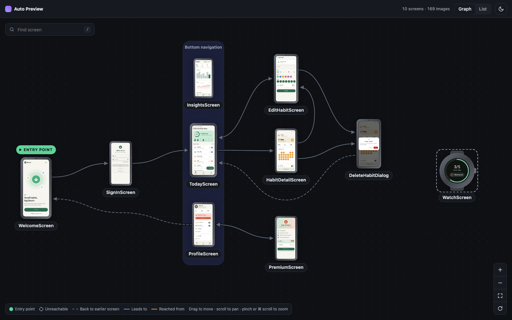
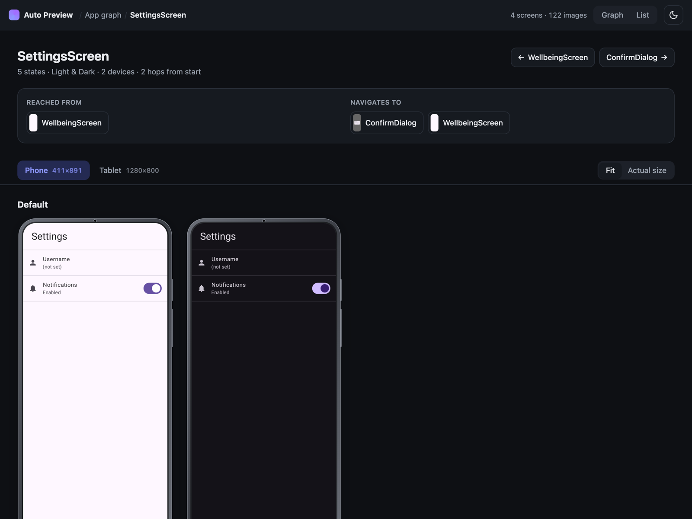
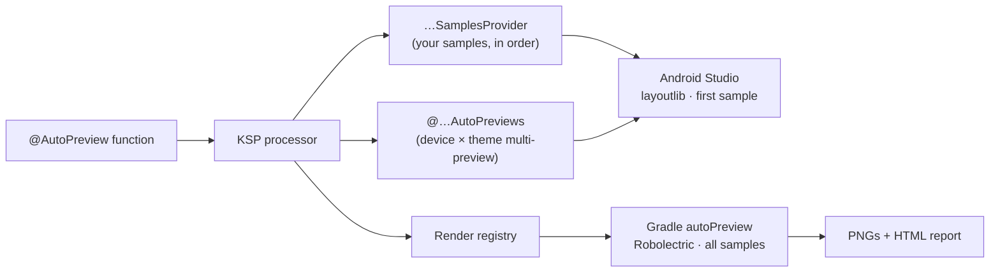

# Compose Auto Preview

[](https://central.sonatype.com/artifact/app.mashlab/compose-auto-preview-annotations)
[](LICENSE)

One annotation per screen gives you every device × theme × state of your Compose UI, plus a browsable map of the app.

<table>
  <tr>
    <td width="50%"><a href="https://drunkendealer.github.io/compose-auto-preview/"></a></td>
    <td width="50%"><a href="https://drunkendealer.github.io/compose-auto-preview/#/screen/TodayScreen/Tablet"></a></td>
  </tr>
  <tr>
    <td align="center"><sub>App graph, laid out from the entry point</sub></td>
    <td align="center"><sub>Every state in light and dark, per device</sub></td>
  </tr>
</table>

<p align="center"><a href="https://drunkendealer.github.io/compose-auto-preview/"><b>▶ Open the live demo report</b></a>: the sample app's 10 screens, 169 renders</p>

## The problem

To see a screen properly you need it on every device, in both themes, in every state: empty, loading, error, long text. Written by hand, that's dozens of `@Preview` functions per screen that nobody keeps up to date.

Put the whole matrix in Android Studio and the preview pane slows down. Studio keeps a render session for every preview cell in the open file, so memory grows with the cell count, and a few screens at `device × theme × state` can take gigabytes.

## The solution

Describe the matrix once and render it in two places:

| Where | What renders | Why |
|---|---|---|
| **Android Studio** | `devices × themes` for the first state | Keeps the preview pane responsive while you edit |
| **`./gradlew autoPreview`** | `devices × themes × states` as PNGs, plus an HTML report | Renders the full matrix outside the IDE, in a separate JVM |

```kotlin
@AutoPreview(
    samplesFrom = SettingsSamples::class,
    devices = [Device.Phone, Device.Tablet],
    themes  = [Theme.Light, Theme.Dark],
)
@SettingsScreenAutoPreviews
@Composable
internal fun SettingsScreenPreview(
    @PreviewParameter(SettingsScreenPreviewSamplesProvider::class) state: SettingsState,
) = SettingsScreen(state)
```

With 5 samples, Studio shows **4** cells and the report holds **20**.

## Quick start

**1. Apply the plugin** next to KSP. It adds the annotations (to `androidMain` in KMP), the KSP processor and Robolectric for you:

```kotlin
plugins {
    alias(libs.plugins.ksp)
    id("app.mashlab.compose-auto-preview") version "4.0.0"
}
```

**2. List the states.** Any `object` with vals of the state type works:

```kotlin
object SettingsSamples {
    val Default          = SettingsState()
    val NotificationsOff = SettingsState(notificationsEnabled = false)
    val Filled           = SettingsState(username = "max")
}
```

**3. Write one preview function**, as in the example above. It must be `internal` or `public`. `@SettingsScreenAutoPreviews` and `SettingsScreenPreviewSamplesProvider` stay red until the first build generates them.

**4. Render the full matrix:**

```
./gradlew :app:autoPreview
…
Auto preview report: file:///…/app/build/autopreview/index.html
```

The report opens in your browser (never on CI; pass `-PautoPreview.open=false` to skip it). The task is incremental, so nothing re-renders if the code didn't change.

In a KMP module, states and samples can live in `commonMain`. The `@AutoPreview` function goes in `androidMain`, where KSP runs.

## How it works



1. **Codegen.** For each `@AutoPreview` function, KSP generates a `PreviewParameterProvider` with your samples and a multi-preview annotation holding the `device × theme` grid.
2. **In the IDE.** Studio sees an ordinary multi-preview and renders it with layoutlib. It shows the first sample only, which keeps the cell count low.
3. **In Gradle.** The plugin generates a render test that runs every function against every sample under Robolectric and writes a PNG per cell. Regular unit test runs skip it.
4. **The report.** A static HTML page draws the screens as a graph from your `entryPoint` along `navigatesTo` edges. It also has a list view and a page per screen with a full-screen viewer (`←`/`→` step, `T` toggles theme, `[`/`]` switch screen, `/` searches).

## Built with

| Tool | Role |
|---|---|
| [KSP](https://kotlinlang.org/docs/ksp-overview.html) | Generates the sample providers, multi-preview annotations and render registry |
| [Compose Preview](https://developer.android.com/develop/ui/compose/tooling/previews) | `@Preview`, multi-preview annotations and `PreviewParameterProvider` drive the IDE pane |
| [Robolectric](https://robolectric.org/) | Renders Compose off-device, in the JVM, for the full matrix |
| Gradle plugin | Wires dependencies, generates the render test, builds the report |
| Vanilla HTML/CSS/JS | The report: no server, no build step, opens from disk |

## Navigation graph

Mark the start screen with `entryPoint` and declare edges with `navigatesTo`. A screen id is the function name without `Preview`:

```kotlin
@AutoPreview(samplesFrom = OnboardingSamples::class, entryPoint = true, navigatesTo = ["SettingsScreen"])
@AutoPreview(samplesFrom = SettingsSamples::class, navigatesTo = ["ConfirmDialog"])
```

Screens the entry point can't reach are drawn dashed on the outer ring. Unknown ids produce a build warning.

<details>
<summary><b><code>@AutoPreview</code> parameters</b></summary>

| Parameter         | Type            | Default                     |
|-------------------|-----------------|-----------------------------|
| `samplesFrom`     | `KClass<*>`     | —                           |
| `locale`          | `String`        | `"en"`                      |
| `devices`         | `Array<Device>` | `[Device.Phone]`            |
| `themes`          | `Array<Theme>`  | `[Theme.Light, Theme.Dark]` |
| `backgroundColor` | `Long`          | `0xFFFFFFFF` (white)        |
| `showSystemUi`    | `Boolean`       | `false`                     |
| `navigatesTo`     | `Array<String>` | `[]`                        |
| `entryPoint`      | `Boolean`       | `false`                     |

`Device`: `Phone`, `Tablet`, `Foldable`, `Desktop`, `Tv`, `Wear` (round). `Theme`: `Light`, `Dark`.

</details>

<details>
<summary><b>Shared config across screens</b></summary>

Hoist the common devices and themes into a wrapper annotation:

```kotlin
@AutoPreview(
    samplesFrom = Unit::class, // placeholder, overridden at use site
    devices = [Device.Phone, Device.Tablet, Device.Foldable, Device.Desktop],
    themes  = [Theme.Light, Theme.Dark],
)
@Target(AnnotationTarget.FUNCTION)
@Retention(AnnotationRetention.SOURCE)
annotation class AppPreview(val samplesFrom: KClass<*>)
```

Then use `@AppPreview(samplesFrom = SettingsSamples::class)` in place of `@AutoPreview`. Any parameter the wrapper declares overrides the meta-annotation's value.

</details>

<details>
<summary><b>Dialogs and bottom sheets</b></summary>

`AlertDialog`, `ModalBottomSheet` and similar render in a separate window, so wrap them in `Box(Modifier.fillMaxSize())` to give the underlay a canvas:

```kotlin
internal fun ConfirmDialogPreview(
    @PreviewParameter(ConfirmDialogPreviewSamplesProvider::class) state: ConfirmDialogState,
) = Box(Modifier.fillMaxSize()) { ConfirmDialog(state) }
```

</details>

<details>
<summary><b>Caveats</b></summary>

- **Report vs Studio fidelity.** Robolectric and layoutlib are close but not always pixel-identical. Infinite animations are frozen at their first frame, and `showSystemUi` isn't drawn in the report.
- **JDK.** The report renders with your target SDK when unit tests run on JDK 21 (Studio's bundled JBR works). Older JDKs fall back to SDK 34.
- **Locale** is a single value. Changing it is a source edit.
- **Per-module report.** `navigatesTo` edges across modules aren't drawn yet.
- **Many screens in one file?** *Settings › Editor › UI Tools › Preview Settings › View Mode: Focus* renders one preview at a time.

</details>

## Requirements

Kotlin 2.0+ · KSP 2.0+ · Jetpack Compose or Compose Multiplatform 1.7+ · `minSdk` 28 · JVM 11

## Contributing

Issues and pull requests are welcome on [GitHub](https://github.com/DrunkenDealer/compose-auto-preview/issues). The [`sample`](sample) module is a working habit-tracker app: run `./gradlew :sample:autoPreview` to try it.

## License

[Apache 2.0](LICENSE)
